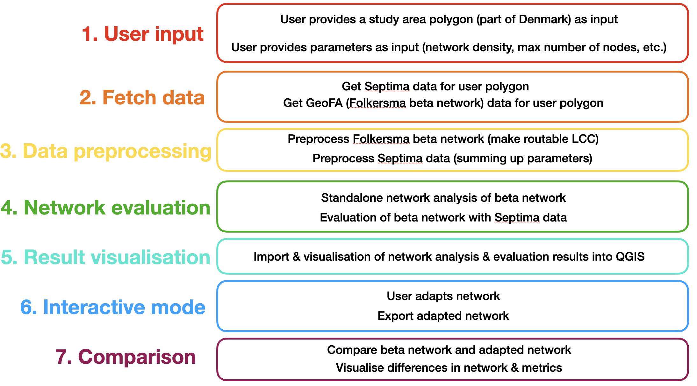

# Knudepunkter project

With this project, we want to assist the planning of *knudepunktnetsværker* (cycle node networks) in Denmark and beyond. For the case of Denmark, there is open access to a beta network for the whole country (cf. GeoFA) and open access data on spatial characteristics relevant for cycling tourism (cf. Septima). This repository contains a set of scripts and detailed instructions. The user can run all scripts with step-by-step explanations in their QGIS Python console. The scripts help the user to do the following:

1. Define the area of interest (a part of Denmark)
2. Fetch spatial data (Septima) and beta network data (GeoFA, provided by Folkersma) for this area
3. Preprocess the fetched data
4. Analyse the beta network structure ("standalone" analysis) and evaluate the beta network based on the spatial characteristics of its surroundings. For example outputs, see the [example spatial evaluation of Aabenraa](https://docs.google.com/document/d/1EDlNlafMbcsxuD0dQE4fuGoUe9agLBOIXC2A8BgM9Q8/edit?usp=sharing) and the [example beta network structure analysis of Stevns](https://drive.google.com/file/d/1dLfnuzi2pgBQXU7zUHwXIr4hIx9o99s7/view?usp=sharing)
5. Visualize and explore results of the analysis in QGIS
6. Adapt the beta network in QGIS and save the adapted ("concept") network
7. Compare (and visualize differences between) the beta and concept networks

## Workflow

Step-by-step in 7 steps:

<p align="left">

</p>

Currently each step will be a Jupyter notebook (see `/scripts/`); those will be converted to `.py` files (that can be run entirely in the QGIS python console) later on.

## Scripts step-by-step and To Dos

### 1. User input

**To Do:** Write a detailed README with screenshots - the user needs to provide a polygon of the study area (cf. BikeDNA) which can be generated through QGIS (explain how). The user also needs to provide the parameters which will be used for the network evaluation based on Septima data (see step 4).

### 2. Fetch data

**To Do:** Write a script that fetches 1. [GeoFA](https://www.geodanmark.dk/home/vejledninger/geofa/hent-geofa/) data (Folkersma beta network for the whole country) and 2. [Septima](https://septima.dk/rida-web/) data. See instructions for fetching layers in the [PyQGIS cookbook](https://docs.qgis.org/testing/en/docs/pyqgis_developer_cookbook/loadlayer.html)

**To Do:** Make sure we have access to the Septima data (currently password protected)

### 3. Preprocess data

* Folkersma beta network: see `03_folkersma_step1/2` (cf. [M1N repo > Folkersma](https://github.com/anastassiavybornova/M1N/tree/master/scripts_python/folkersma)) - **To Do:** change to fetching data from GeoFA as soon as there is some available there, and adapt to folder/data structure of this repository
* Septima data: cf `scripts/03_septima_draft.ipynb` - **To Do:** script needs to be edited to fetch data for user-defined polygon from https://septima.dk/rida-web/ instead of (current version) accessing and cutting the entire, locally downloaded, data sets.

### 4. Network evaluation

* Standalone analysis: network (structural) analysis in Python, with only Folkersma beta network as input (metrics: node and edge betweenness; ...) (cf. `scripts/04_analyse_networkstructure.ipynb`) 
* Evaluation based on Septima data: spatial analysis in Python, based on Septima data with user-defined parameters (metrics: how close are POIs/facilities? which edges lead through nature areas? etc.) (cf. `scripts/04_evalute_network.ipynb`)

**To Do:** Adjust both scripts to fit the data structure above

### 5. Result visualisation

**To Do:** Write Python script that imports results and generates result visualization (one group of layers for standalone network analysis, another group of layers for spatial evaluation)

**To Do:** Write qmd stylesheet for results (will be provided to user)

### 6. Interactive mode

User modifies beta network layer in QGIS based on network analysis and spatial evaluation, to create the concept network. Once modification is finished, user runs a script to export the concept network. **To Do**: Write detailed README for the modification; and short script for the export of results.

### 7. Comparison

The beta and concept networks are compared (with the same metrics as in step 4) and visualized. **To Do:** Write script that imports and displays results

## Setting up the virtual environment

(Currently, to work with the notebooks)

Run in your terminal:
```
conda create --name knupu python=3.9
conda activate knupu
conda config --prepend channels conda
conda config --prepend channels conda-forge
conda install numpy matplotlib pandas geopandas shapely contextily networkx momepy qgis ipykernel
```